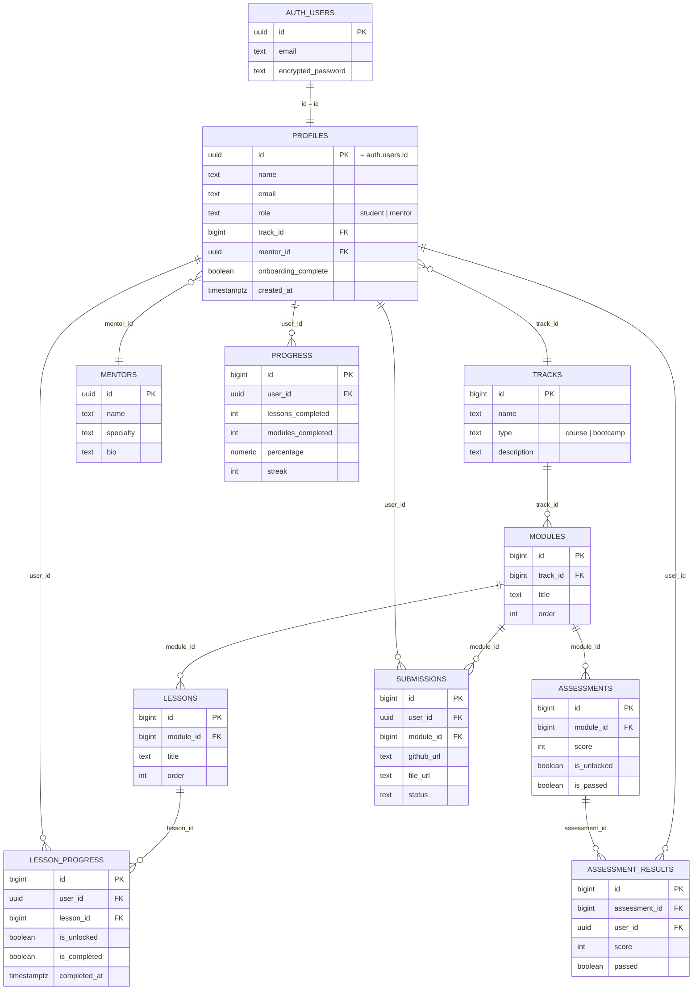

# Entity Relationship Diagram — EduFlick AI LMS

This ERD covers the full shared data model so all three members' work fits
together. Tables marked **(Member 1)** are defined in
`sql/01_schema.sql` and owned by this portion of the project. Tables marked
**(Member 2)** / **(Member 3)** are shown as references only — they belong to
the other members' deliverables and are included here so the group ERD is
complete and the foreign keys line up.

## Notes on schema decisions (Member 1)

These are deliberate adaptations from the original shared contract sketch —
worth flagging to Members 2 & 3 since they touch shared tables:

- **`profiles` replaces `users`.** Supabase Auth owns credentials
  (`auth.users`), so `profiles` holds everything else (`name`, `email`,
  `role`, `track_id`, `mentor_id`, `onboarding_complete`). `profiles.id`
  always equals the matching `auth.users.id`.
- **`mentors` is a separate lightweight table**, not part of `profiles`.
  This lets mentors be seeded as plain reference data without creating
  login accounts. `profiles.mentor_id` points at `mentors.id`.
- **`lessons` is a pure curriculum template** (`module_id`, `title`,
  `order`) with no per-student fields. Per-student state — `is_unlocked`,
  `is_completed`, `completed_at` — lives in **`lesson_progress`**, keyed by
  `(user_id, lesson_id)`. This is the table Member 1's unlock automation
  reads and writes, and it's also the natural source for Member 2's
  `progress` aggregation (e.g. `lessons_completed` = count of
  `lesson_progress` rows with `is_completed = true` for a user).
- **`modules`** carries `track_id` and `order` so both the roadmap (Member 1)
  and assessments (Member 2) can be ordered consistently per track.
