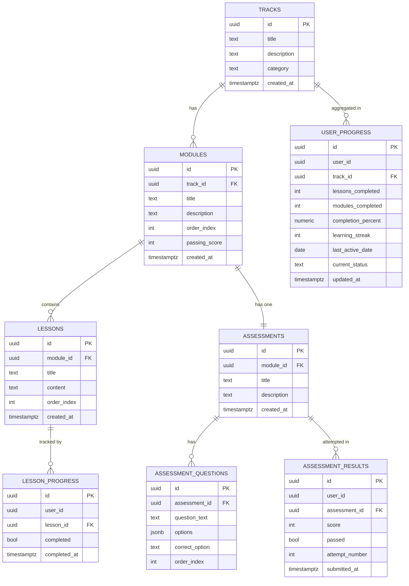
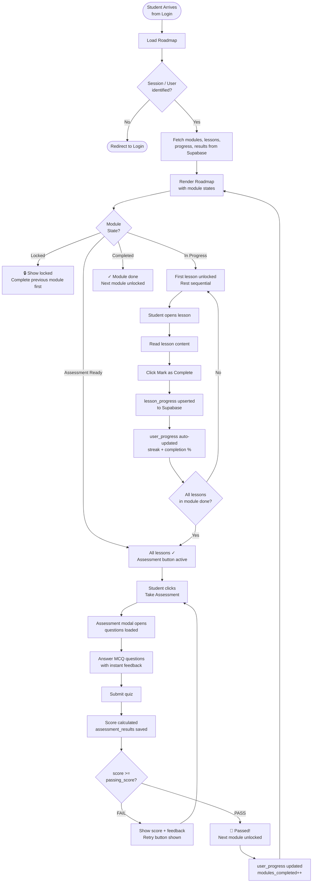
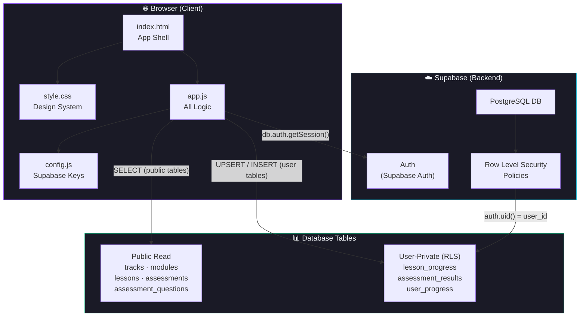

# EduFlick AI LMS — Member 2
## Complete Documentation Package

> **Member 2 Scope:** Progress Tracking · Module Assessment Automation · Module Progression Logic

---

## Table of Contents
1. [System Overview](#system-overview)
2. [Database Schema (ERD)](#database-schema-erd)
3. [Automation Logic](#automation-logic)
4. [Workflow Diagram](#workflow-diagram)
5. [System Architecture](#system-architecture)
6. [Setup Guide](#setup-guide)
7. [File Structure](#file-structure)

---

## System Overview

Member 2 owns the **learning engine** of EduFlick AI — the system that decides what a student can access, tracks every action they take, and automatically updates their progress status. It consists of three tightly linked subsystems:

| Subsystem | Requirement | What it does |
|-----------|------------|--------------|
| **Progress Tracking** | #4 | Auto-records lessons/modules completed, % done, streak, status |
| **Assessment Automation** | #5 | Unlocks quiz after all lessons done; enforces configurable pass mark; stores every attempt |
| **Module Progression** | #6 | Passing assessment unlocks the next module and refreshes the entire roadmap view |

---

## Database Schema (ERD)

### Entity Relationship Diagram



### Table Descriptions

| Table | Purpose | Key Fields |
|-------|---------|-----------|
| `tracks` | Top-level learning tracks (e.g. AI Foundations) | `category` (main_course / bootcamp) |
| `modules` | Ordered modules inside a track | `order_index`, `passing_score` (configurable per module) |
| `lessons` | Individual lessons inside a module | `order_index` for sequential unlock |
| `assessments` | One quiz per module | Linked 1:1 to module via `module_id UNIQUE` |
| `assessment_questions` | MCQ questions per assessment | `options` stored as JSONB array |
| `lesson_progress` | One row per user per lesson | `UNIQUE(user_id, lesson_id)` — upserted on completion |
| `assessment_results` | Every quiz attempt stored | `passed = score >= module.passing_score` |
| `user_progress` | Aggregate stats per user | Auto-updated after every action; `UNIQUE(user_id)` |

### Row Level Security

All user-data tables (`lesson_progress`, `assessment_results`, `user_progress`) have RLS enabled — users can only read/write their own rows. Content tables (`tracks`, `modules`, `lessons`, `assessments`, `assessment_questions`) are public read.

---

## Automation Logic

### Trigger Map

```
USER ACTION                    AUTOMATIC RESPONSE
─────────────────────────────────────────────────────────────────────
Click "Mark as Complete"   →   lesson_progress upserted (completed=true)
  └─ Lesson N completed    →   Lesson N+1 unlocked in UI
  └─ ALL lessons done      →   Assessment button activates for module
  └─ user_progress updated →   lessons_completed++, completion_percent recalculated

Click "Take Assessment"    →   Assessment modal opens (only if all lessons done)
  └─ Answer each question  →   Immediate correct/wrong visual feedback
  └─ Submit quiz           →   assessment_results row inserted
                           →   passed = (score >= module.passing_score)
                           →   user_progress.modules_completed updated
  └─ PASSED                →   Next module UNLOCKED in roadmap (in real-time)
  └─ FAILED                →   Retry button shown; attempt_number++
  └─ ANY submit            →   user_progress.completion_percent recalculated
                           →   learning_streak updated
```

### Lesson Sequential Unlock Logic

```
isLessonUnlocked(lesson, index, module):
  IF module is locked          → return FALSE
  IF index === 0               → return TRUE   (first lesson always open)
  IF lessons[index-1].done     → return TRUE   (previous completed)
  ELSE                         → return FALSE
```

### Assessment Unlock Logic

```
assessmentAvailable(module):
  allLessonsDone = module.lessons.every(l => lessonProgress[l.id] === true)
  RETURN allLessonsDone
```

### Module Unlock Logic (Progression)

```
getModuleState(module, index):
  IF index === 0               → always unlocked (first module)
  prevAssessment = modules[index-1].assessment
  prevPassed = assessmentResults[prevAssessment.id]
               .some(r => r.score >= modules[index-1].passing_score)
  IF NOT prevPassed            → return "locked"
  ELSE                         → compute state from lessons/assessment
```

### Progress Stat Update Logic

Triggered after **every** lesson completion or assessment submission:

```
1. Count lessonsDone   = all lessons where lessonProgress[id] === true
2. Count modulesDone   = modules where ANY result has score >= passing_score
3. completionPct       = (lessonsDone / totalLessons) × 100
4. Streak:
   - today == last_active_date  → no change
   - today == yesterday + 1     → streak + 1
   - else                       → streak reset to 1
5. Upsert user_progress (single row per user)
6. Re-render roadmap + stats bar
```

### Configurable Passing Score

Each module independently sets its own `passing_score` in the DB:

| Module | Pass Mark |
|--------|-----------|
| Introduction to AI | 70% |
| Machine Learning Basics | 75% |
| Neural Networks | 80% |
| Prompt Engineering | 70% |

This means harder modules require a higher score before the next module unlocks.

---

## Workflow Diagram

### Student Journey (Member 2 Scope)



---

## System Architecture



### Data Flow

```
1. PAGE LOAD
   Browser → Supabase Auth → check session
   Browser → Supabase DB  → fetch tracks, modules, lessons (public)
   Browser → Supabase DB  → fetch lesson_progress, assessment_results, user_progress (RLS)

2. LESSON COMPLETE
   Browser → Supabase DB → UPSERT lesson_progress
   Browser → Supabase DB → UPSERT user_progress (recalculated)
   Browser → Re-renders roadmap UI

3. ASSESSMENT SUBMIT
   Browser → Calculate score locally
   Browser → Supabase DB → INSERT assessment_results
   Browser → Supabase DB → UPSERT user_progress
   Browser → Re-renders roadmap + unlocks next module
```

---

## Setup Guide

### Step 1 — Supabase Project

1. Create a free project at [supabase.com](https://supabase.com)
2. Go to **SQL Editor** → run the full contents of `schema.sql`
3. This creates all 8 tables + RLS policies + 4 modules + 12 lessons + 20 quiz questions

### Step 2 — Configure Keys

Open `config.js` and fill in your Supabase credentials:

```js
const SUPABASE_URL     = 'https://YOUR_PROJECT.supabase.co';
const SUPABASE_ANON_KEY = 'your-anon-key';
```

### Step 3 — Run Locally

```bash
# Option A — npx serve (recommended)
npx serve . -p 3000
# Open: http://localhost:3000

# Option B — VS Code Live Server
# Right-click index.html → "Open with Live Server"

# Option C — Python
python -m http.server 3000
```

### Step 4 — Demo Mode vs Live Mode

| Mode | How it works | When to use |
|------|-------------|-------------|
| **Demo mode** | Click "Enter Dashboard" — no login needed, state in memory | Presentations, demos |
| **Live mode** | Real Supabase auth session (from Member 1's login page) | Production / grading |

---

## File Structure

```
eduflick-ai-lms/
├── index.html              ← Login/entry page (temp demo login)
└── member2/
    ├── index.html          ← Main app (roadmap + progress views)
    ├── style.css           ← Full dark design system
    ├── app.js              ← All logic: progress, assessments, progression
    ├── config.js           ← Supabase credentials
    ├── schema.sql          ← Full DB schema + seed data
    └── README.md           ← This documentation
```

---

## Requirements Checklist

| # | Requirement | Status | Implementation |
|---|-------------|--------|----------------|
| 4 | Auto-update lessons completed | ✅ | `lessonProgress` map + `user_progress` upsert |
| 4 | Modules completed count | ✅ | Counts modules with a passing `assessment_results` row |
| 4 | % completion | ✅ | `(lessons_done / total_lessons) × 100` |
| 4 | Learning streak | ✅ | Date diff logic; increments daily, resets on miss |
| 4 | Current status | ✅ | `in_progress` / `completed` in `user_progress` |
| 5 | Assessment unlocks after all lessons | ✅ | Button hidden until `allLessonsDone === true` |
| 5 | Configurable passing score per module | ✅ | `modules.passing_score` (distinct per module) |
| 5 | Retry logic | ✅ | Each attempt stored; `attempt_number` incremented |
| 6 | Passing assessment unlocks next module | ✅ | `getModuleState()` checks previous module's results |
| 6 | Updates progress stats | ✅ | `updateProgressStats()` called after every action |
| 6 | Refreshes roadmap view | ✅ | `renderRoadmap()` called after every state change |
